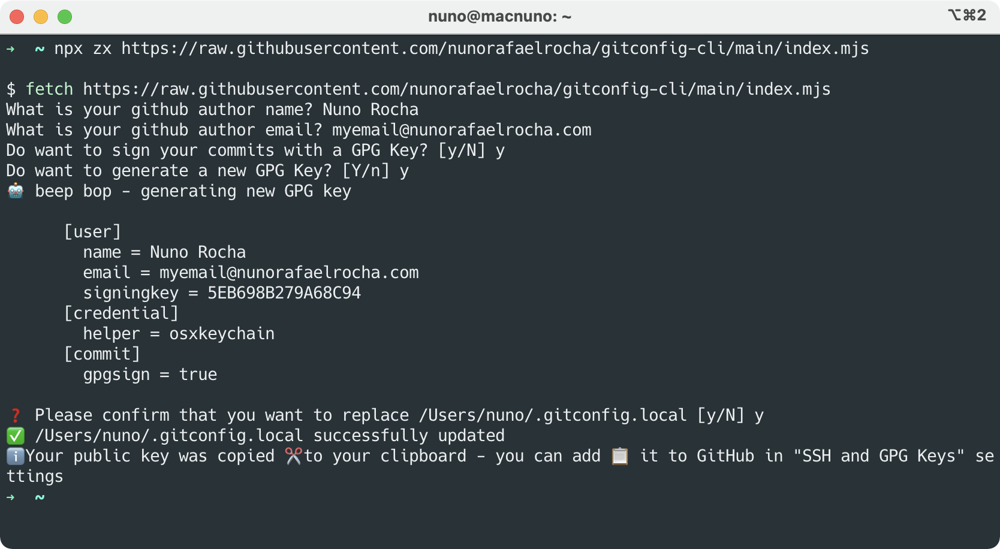

# gitconfig-cli

A small script that helps to configure git, including signed commits with GPG.



## 🚀 Usage

```sh
npx zx https://raw.githubusercontent.com/nunorafaelrocha/gitconfig-cli/main/index.mjs
```

### 🖥 System Requirements

- Node.js >= 14
- npx
- GPG (if you want to sign commits)

### 💾 Installing system requirements

**Node.js and npx**

```sh
brew install n
n latest
```

**GPG**

```
brew install --cask gpg-suite-no-mail
```

For more tools see my [dotfiles](https://github.com/nunorafaelrocha/dotfiles)

## 👮 License

The MIT License (MIT) 2021 - [Nuno Rafael Rocha](https://nunorafaelrocha.com). Please have a look at the [LICENSE.md](https://github.com/nunorafaelrocha/gitconfig-cli/blob/main/LICENSE.md) for more details.
